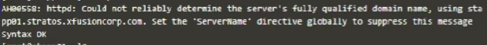

# Question
Our monitoring tool has reported an issue in Stratos Datacenter: the Apache service on one of the app servers is not reachable on port 8089. The cause could be a down service, firewall rules, or another network issue. Use tools like telnet, netstat, etc. to find and fix the issue. Make sure Apache is reachable from the jump host without compromising any security settings.

<span style="color: red;">The below commands based on different question server, user name & other details that might differ. So please read the task carefully before executing it. </span>

# Steps

**Step 1: Identify the affected app server**
- Use telnet from the jump host to check connectivity to all app servers on port 8089.
  ```
  telnet stapp01 8089
  telnet stapp02 8089
  telnet stapp03 8089
  ```
  > *Tests network connectivity to each app server on the Apache port. The server that fails to connect is the one to troubleshoot further.*

**Step 2: Log in to the affected app server and switch to root user**
- Connect to the server and gain root privileges.
  ```
  ssh tony@stapp01
  sudo su -
  ```
  > *Establishes a secure shell session to the app server and switches to root for troubleshooting.*

**Step 3: Check Apache service status and start it if needed**
- Verify if Apache is running and start it if not.
  ```
  systemctl status httpd
  systemctl start httpd
  ```
  > *Checks the status of the Apache service and starts it if it is not running.*

**Step 4: Investigate service errors if Apache fails to start**
- Get detailed error information and check for port conflicts.
  ```
  systemctl status httpd
  netstat -tulnp
  ```
  > *Displays error logs and lists all services using network ports. Look for port 8089 conflicts and note the PID if another service is using it.*

**Step 5: Resolve port conflicts if present**
- Kill the process using port 8089, if necessary.
  ```
  kill <PID>
  ```
  > *Stops the conflicting process so Apache can use the required port.*

**Step 6: Check Apache configuration and fix syntax errors**
- Test the Apache config file for errors.
  ```
  httpd -t
  ```
  > *Checks for syntax errors in the config file. If errors are found, review the output below.*

  
  > *Example error output from `httpd -t`. Use this to identify and fix configuration issues.*

**Step 7: Edit the Apache configuration file to resolve errors**
- Open the config file and make necessary changes (e.g., set the correct ServerName or port).
  ```
  vi /etc/httpd/conf/httpd.conf
  ```
  > *Edit the configuration file to fix any issues identified in the previous step. For example, add the following line to set the ServerName with IP and port:*
  ```
  ServerName 172.16.238.10:8089
  ```
  > *This ensures Apache knows which IP and port to listen on, resolving the error shown above.*

**Step 8: Restart Apache and verify service status**
- Restart the service and confirm it is running.
  ```
  systemctl restart httpd
  systemctl status httpd
  ```
  > *Restarts Apache and checks its status to ensure it is running properly.*

**Step 9: Check firewall rules and clear if necessary**
- List and flush iptables rules if they block the port.
  ```
  iptables -L
  iptables -F
  ```
  > *Lists current firewall rules and flushes them to remove any blocks on port 8089. Use with caution as this affects all firewall rules.*

**Step 10: Validate connectivity from the jump host**
- Test access to the Apache service from the jump host.
  ```
  telnet stapp01 8089
  curl http://stapp01:8089
  ```
  > *Confirms that the Apache service is now reachable on port 8089 from the jump host.*

**Step 11: Complete the task**
- Click on confirm to complete the task