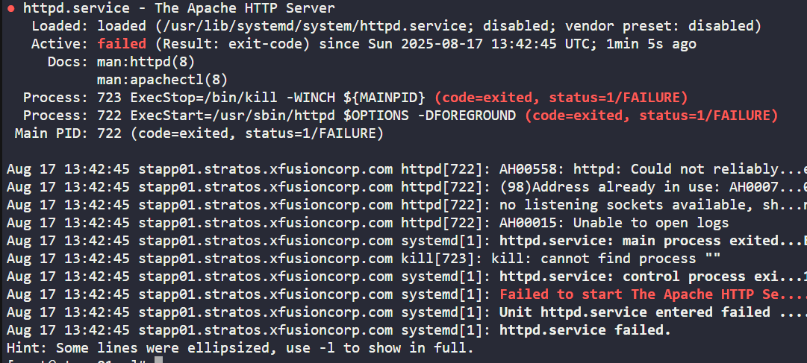

# Question
The production support team of xFusionCorp Industries has deployed monitoring tools to track service availability. One monitoring system reported Apache service unavailability on one of the app servers in Stratos DC.

**Identify the faulty app host and fix the issue. Make sure Apache service is up and running on all app hosts, specifically on port 6300.**

<span style="color: red;">The below commands based on different question server, user name & other details that might differ. So please read the task carefully before executing it. </span>

# Steps

**Step 1: Identify the app server with Apache issues**
- Use telnet from the jump host to check connectivity to all app servers on port 6300.
  ```
  telnet stapp01 6300
  telnet stapp02 8087
  telnet stapp03 8087
  ```
  > *Tests network connectivity to each app server on the Apache port. The server that fails to connect is the one to troubleshoot further.*

**Step 2: Log in to the affected app server and switch to root user**
- Connect to the server and gain root privileges.
  ```
  ssh tony@stapp01
  sudo su -
  ```
  > *Establishes a secure shell session to the app server and switches to root for troubleshooting.*

**Step 3: Check and start Apache HTTPd service**
- Try to start the Apache service and check its status if it fails.
  ```
  systemctl start httpd
  systemctl status httpd
  ```
  > *Attempts to start Apache and checks its status for error details if it fails. Review the error output for clues.*

  
  > *Example error output from `systemctl status httpd`. Use this to identify and fix service issues.*

**Step 4: Check for port conflicts using netstat**
- Find out which process is using the required port and its PID.
  ```
  netstat -tulnp
  ```
  > *Lists all services using network ports and helps identify port conflicts.*

**Step 5: Kill the conflicting process if needed**
- Find and kill the process using the port.
  ```
  ps -ef | grep sendmail
  kill <PID>
  ps -ef | grep sendmail
  ```
  > *Finds the process by name and PID, then kills it to free up the port for Apache.*

**Step 6: Start Apache HTTPd service and check status again**
- Start the service and confirm it is running.
  ```
  systemctl start httpd
  systemctl status httpd
  ```
  > *Starts Apache and checks its status to ensure it is running properly.*

**Step 7: Validate Apache HTTPd from the jump host**
- Test connectivity to the Apache service from the jump host.
  ```
  telnet stapp01 6300
  ```
  > *Confirms that the Apache service is now reachable on port 6300 from the jump host.*

**Step 8: Complete the task**
- Click on Finish & Confirm to complete the task successfully.